# Table of Contents

- [About](#about)
- [Demo](#demo)
- [Essential Data Collection](#essential-data-collection)
- [Implementation](#implementation)
- [Results](#results)
- [Quick Summary of Execution Steps](#quick-summary-of-execution-steps)
- [Contacts](#contacts)

 
 

# About

&nbsp;&nbsp;&nbsp;&nbsp;This repository contains the code and resources for my bachelor's thesis project at Amirkabir University of Tehran. The project focuses on the automated detection of road lines and integration into Geographic Information System (GIS) using smartphone-based camera and motion data. The approach leverages a deep learning model to detect road lines from videos, processes and filters the detected lines, and visualizes them on a map, providing an efficient and cost-effective solution for urban infrastructure monitoring.

This approach has two significant applications:

1. **Urban Infrastructure Monitoring**: The generated maps can assist municipalities in monitoring and improving road line markings.
2. **Autonomous Vehicles**: Accurate road line information provides crucial data for autonomous vehicle systems, helping them better identify paths and make decisions in situations where the distance is beyond the range of the vehicle's cameras and sensors.

**--> Line detection deep learning model:**  
&nbsp;&nbsp;&nbsp;&nbsp;For the road line detection, we utilized the [LaneAF](https://paperswithcode.com/paper/laneaf-robust-multi-lane-detection-with) model with DLA-34 backbone, which has been pre-trained on the CULane dataset. This model provides high accuracy in detecting lane markings under various conditions. The LaneAF model was developed by Hala Abualsaud and her collaborators. For more details on the LaneAF model and its implementation, please refer to the [LaneAF GitHub repository](https://github.com/sel118/LaneAF?tab=readme-ov-file).

 
 

# Demo

To better understand what has been accomplished in this project, here is a demonstration of the results.  
For testing the project, we selected two streets with a total length of 4 kilometers in Tehran city. [Tap to see on the map.](https://www.google.com/maps?q=35.756888,51.372461) 
To view the visualized lane lines of these two streets (final output of my project), simply drag and drop the [`final_smoothed_lines.kml`](<https://github.com/alirezaghafari/Smart-road-lines-detection_and_integration_with_GIS/tree/master/output_kmls/smoothed_lines(final_output)/>) file into a GIS tool such as Google Earth. Some of the images are shown below:

### Detected Road Lines Using LaneAF:

  

### Visualized Lines on Map (Final Result of My Project):

  

 
 

# Essential Data Collection

For visualizing road lines on the map, you only need:

1. **Video of the street with exact timestamps** for syncing frames with location and motion data. LaneAF will predict lines on these frames.
2. **Precise location and magnetic heading** of the phone, both with millisecond timestamps.
3. **IMU data** for mobile phone rotation.
4. **Precise position of objects within a few pixels relative to the camera** (assuming the camera is at the origin). This is used for positioning all other pixels relative to the camera. So you need to record at least 4 pixels' coordinates (x, y) and the position of objects represented by these pixels relative to the camera.

 

### $\color{gold}{1-}$ Videos of The Streets

&nbsp;&nbsp;&nbsp;&nbsp;Initially, you need to collect videos of the streets to identify the road markings. The more similar the features of the images, such as zoom and camera angle, are to the CULane dataset, the better the results you will achieve with the LaneAF model. You can see an example of a suitable image in the [Demo](#demo) section. We fixed the camera using a mount on the vehicle's dashboard and set the camera zoom to 0.5x, which provided very good results. For this task, we used an iPhone camera and the third-party app [TimestampCamera](http://www.timestampcamera.com/) to precisely record the exact timestamp of each frame to the millisecond.

|                          **Camera Fixed on the Vehicle's Dashboard**                           |                            **Timestamp Camera iOS App**                            |
| :--------------------------------------------------------------------------------------------: | :--------------------------------------------------------------------------------: |
|  |  |

 
 

### $\color{gold}{2-}$ Location and Magnetic Heading

&nbsp;&nbsp;&nbsp;&nbsp;For precise recording of latitude, longitude, and magnetic heading at any given moment, we developed a Swift application called [MyApp](<https://github.com/alirezaghafari/Smart-road-lines-detection_and_integration_with_GIS/tree/master/myapp%20(to_record_locations_and_magnetic_headings)>). This app captures these data at a frequency of 50 Hz. The geographic coordinates (latitude and longitude) recorded each second usually remain the same due to the mobile sensor limitations. However, the main purpose of our application is to determine the exact moment when new location data is updated. This ensures that we can select a frame from the video for visualizing road markings with confidence, knowing that we have the most current location data. As a result, the error from the phone’s low-frequency position measurements is reduced to just one-fiftieth of what it would be with once-per-second location updates.

  

  Myapp Records Locations and Magnetic Heading

 

### $\color{gold}{3-}$ IMU Data for Mobile Phone Rotation

&nbsp;&nbsp;&nbsp;&nbsp;To analyze vehicle movement, it is important to collect motion data from the mobile phone. For this purpose, we used the [Sensor Logger](https://github.com/tszheichoi/awesome-sensor-logger) app, which can record motion data at a high frequency. We utilized the angular rotation data of the mobile phone in the process of filtering out noisy lines.

  

  Sensor Logger Records IMU Data

 

### $\color{gold}{4-}$ Precise Position of Objects within a Few Pixels Relative to the Camera

&nbsp;&nbsp;&nbsp;&nbsp;During image capture, it's necessary to record the precise position of several objects within the image along with the pixels representing them, relative to the camera's position, which is assumed to be at the origin. This data will be used to determine the position of all pixels in the image using a homography matrix. To ensure the accuracy of this information, it's crucial that the camera remains fixed on the vehicle's dashboard throughout the recording, without any movement. Therefore, it's important to use a stable phone mount.  
&nbsp;&nbsp;&nbsp;&nbsp;To form a homography matrix, at least 4 pixels with their positions relative to the camera are required. For testing this project, we recorded 11 such points. The image below shows the recorded positions. Please note that this data is only valid for our images. Therefore, you will need to record the positions again on the day of your image capture.

  

    Precise Position of Objects within a Few Pixels Relative to the Camera

 
 

# Implementation

The implementation consists of five main steps:

1. **Detecting road lines within images** using the deep learning model and saving the binary masks.
2. **Modeling the road lines** with a linear equation using linear regression, followed by calculating the homography matrix to **position the modeled lines relative to the camera**.
3. **Filtering out noisy lines** to ensure accuracy.
4. **Finding the global position of the modeled lines** using the camera's location data and the position of each line relative to the camera (creating a KML file).
5. **Smoothing the sequential lines** that are not perfectly aligned with each other.

 
 

### $\color{gold}{1-}$ Detecting Road Lines within Images

To detect road lines in video, follow these steps:

1. **Download the [LaneAF GitHub repository](https://github.com/sel118/LaneAF)** and copy the files from the [`laneaf_inference`](https://github.com/alirezaghafari/Smart-road-lines-detection_and_integration_with_GIS/tree/master/laneaf_inference) folder we've provided into the LaneAF directory.

   > The [`net_0033.pth`](https://github.com/alirezaghafari/Smart-road-lines-detection_and_integration_with_GIS/blob/master/laneaf_inference/net_0033.pth) file contains the pre-trained model weights, trained on the CULane dataset. The [`mask_of_all_frames.py`](https://github.com/alirezaghafari/Smart-road-lines-detection_and_integration_with_GIS/blob/master/laneaf_inference/mask_of_all_frames.py) script is used to save binary masks for all frames in a video. It reads a video and saves all the masks in a folder. The [`visualize_laneaf_on_one.py`](https://github.com/alirezaghafari/Smart-road-lines-detection_and_integration_with_GIS/blob/master/laneaf_inference/visualize_laneaf_on_one.py) script saves the model's colored prediction for a single image. In this project, you need to run the `mask_of_all_frames.py` script, but we have also included the `visualize_laneaf_on_one.py` script as an optional tool, so you can view the colored output if needed.

2. You can perform predictions in two ways (prediction with CPU is not recommended as processing each frame may take several minutes):

   1. **If you have an NVIDIA GPU**, you can directly run the `mask_of_all_frames.py` or `visualize_laneaf_on_one.py` scripts. Don't forget to set the snapshot, which is the [`net_0033.pth`](https://github.com/alirezaghafari/Smart-road-lines-detection_and_integration_with_GIS/blob/master/laneaf_inference/net_0033.pth) file, as an input argument.
   2. **Alternatively, you can use a T4 GPU on [Google Colab](https://colab.research.google.com/)**. We've provided a Jupyter notebook [`perdictByLaneaf.ipynb`](https://github.com/alirezaghafari/Smart-road-lines-detection_and_integration_with_GIS/blob/master/perdictByLaneaf.ipynb) for this purpose. You need to upload the LaneAF folder (with the 3 inference files copied into it) to your Google Drive. Then, run the notebook in Google Colab. Make sure to change your runtime to T4 GPU first.

By following these steps, you can effectively generate binary masks for road lines within your video frames.

> **Important Note:** Before predicting on video frames, crop the video to an aspect ratio of 1664x576 or a multiple of it. Otherwise, your output image may appear stretched, and the model may not perform well. It is recommended to crop out non-essential parts, such as the sky, to optimize the input for better results.

 

### $\color{gold}{2-}$ Modeling the road lines and positioning the modeled lines relative to the camera

The direct visualization and positioning of the model's output masks can be problematic for two main reasons:

- **Cluttered and messy map:** The road line markings have a significant width, leading to an overcrowded and confusing map.
- **Inefficient positioning:** Due to the large number of pixels representing the road lines, positioning becomes highly inefficient.

&nbsp;&nbsp;&nbsp;&nbsp;To address these issues, each road line needs to be modeled as a single line equation. This can be achieved using linear regression. By doing so, each road line is represented by a line equation, meaning that only the start and end points of each line in each frame will represent that road line. This approach results in a much cleaner final map and significantly reduces the number of necessary computations (since only the start and end points need to be positioned and visualized).

&nbsp;&nbsp;&nbsp;&nbsp;To better understand, look at the image below. It shows the original model's mask and the lines fitted using linear regression. In the end, we only need to visualize start and end points representing each road line and connect those two points, which results in faster processing.

|                           **Original Mask**                           |                          **Fitted Lines using Linear Regression**                           |
| :-------------------------------------------------------------------: | :-----------------------------------------------------------------------------------------: |
|  |  |

&nbsp;&nbsp;&nbsp;&nbsp;Now, we need to position the start and end points of each line relative to the camera. To achieve this, we use a homography matrix. The homography matrix is computed using at least four pixels from the image and the actual positions of the objects represented by those pixels (we recorded the positions of 11 points, but you will need to do this again for your own data).

&nbsp;&nbsp;&nbsp;&nbsp;The homography matrix corrects for perspective distortion, adjusting the scale of the image and the distances between objects. This allows us to obtain the precise position of each pixel relative to the camera. For better understanding, see the image below called bird's eye view.

|         **Road Image**          |              **Bird's Eye View**               |
| :-----------------------------: | :--------------------------------------------: |
| 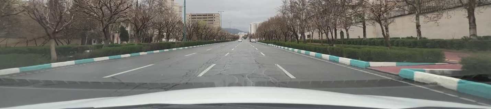 | 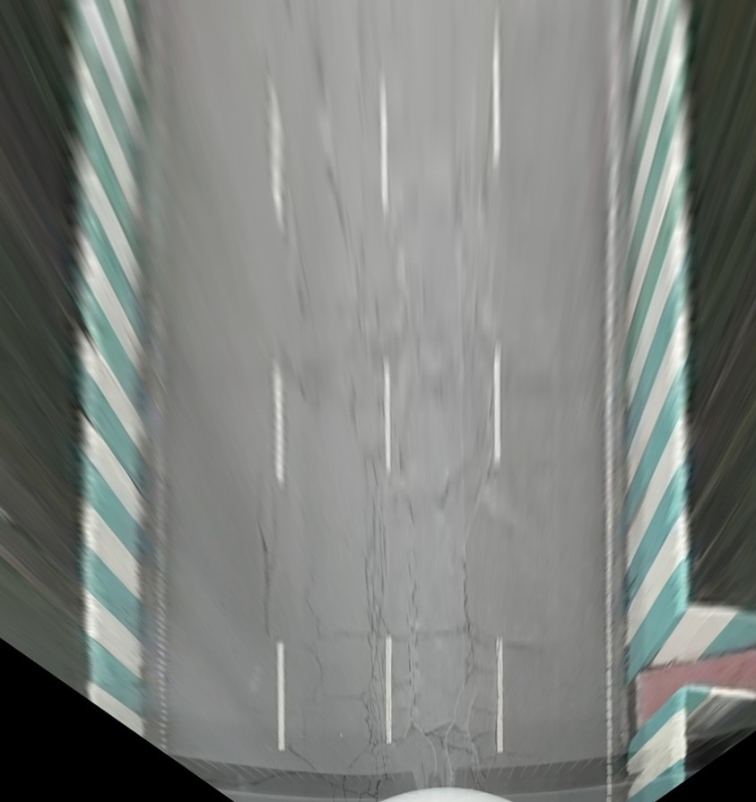 |

---

 
 
 

  

    Bird's Eye View of Masks (Before Fitting Lines Using Linear Regression)

---

 
 
 

|                           **Fitted Lines**                            |                     **Bird's Eye View of Fitted Lines**                     |
| :-------------------------------------------------------------------: | :-------------------------------------------------------------------------: |
| 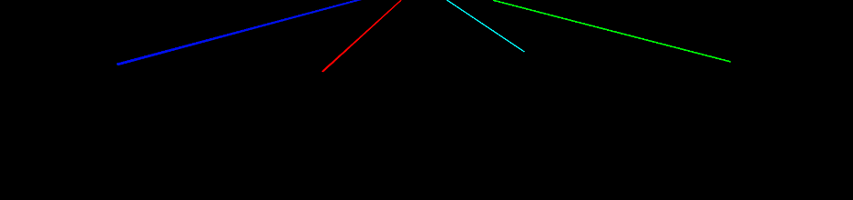 |  |

&nbsp;&nbsp;&nbsp;&nbsp;Both the steps of modeling the lines and positioning them using the homography matrix are handled by the [`masks_to_line_equation.py`](https://github.com/alirezaghafari/Smart-road-lines-detection_and_integration_with_GIS/blob/master/main%20codes/masks_to_line_equation.py) file. This script takes the output masks from the model as input and generates a file named [`lines_data.json`](https://github.com/alirezaghafari/Smart-road-lines-detection_and_integration_with_GIS/blob/master/output_jsons/lines_data.json).

&nbsp;&nbsp;&nbsp;&nbsp;The `lines_data.json` file contains the position of all lines in each frame. These positions are relative to the camera and are measured in pixels, with each pixel representing 10 centimeters in the real world. This scale is defined by the size of the bird's eye view image. You can define any scale that suits your needs.

 

### $\color{gold}{3-}$ Filtering out noisy lines

&nbsp;&nbsp;&nbsp;&nbsp;Now that we have recorded the position of each line relative to the camera and the geographic coordinates of the camera, we can visualize the lines on the map. However, as shown in the image below, there are many noisy lines that make the output less clean and organized. This issue arises from several factors:

- **Short Lines**: Many lines are very short and often misinterpreted by the model.
- **Lines with Unusual Slopes**: Lines with unconventional slopes.
- **Too Close Lines**: Lines that are much closer together than expected.

  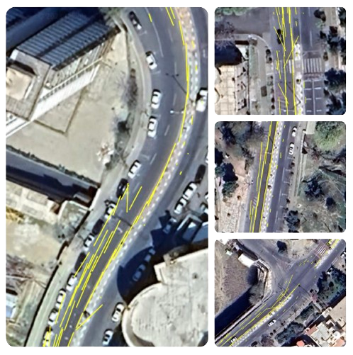

    Visualized Lines Without Filtering

&nbsp;&nbsp;&nbsp;&nbsp;To address this, we use three different filters to remove these noisy lines. The filters are implemented through three separate functions in the file [noise_filter.py](https://github.com/alirezaghafari/Smart-road-lines-detection_and_integration_with_GIS/blob/master/main%20codes/noise_filter.py). This file takes the following inputs:

- [`lines_data.json`](https://github.com/alirezaghafari/Smart-road-lines-detection_and_integration_with_GIS/blob/master/output_jsons/lines_data.json)
- [`timestamp_of_each_frame.json`](https://github.com/alirezaghafari/Smart-road-lines-detection_and_integration_with_GIS/blob/master/output_jsons/timestamp_of_each_frame.json)
- [`Angular_Velocity.csv`](https://github.com/alirezaghafari/Smart-road-lines-detection_and_integration_with_GIS/blob/master/IMU_data/Angular_Velocity.csv)

and produces three filtered line files:

- [`"1_filtered_lines_by_length.json"`](https://github.com/alirezaghafari/Smart-road-lines-detection_and_integration_with_GIS/blob/master/output_jsons/1_filtered_lines_by_length.json)
- [`"2_filtered_lines_by_length_and_slope_and_yaw.json"`](https://github.com/alirezaghafari/Smart-road-lines-detection_and_integration_with_GIS/blob/master/output_jsons/2_filtered_lines_by_length_and_slope_and_yaw.json)
- [`"3_filtered_lines_by_length_and_slope_and_yaw_and_closeLines.json"`](https://github.com/alirezaghafari/Smart-road-lines-detection_and_integration_with_GIS/blob/master/output_jsons/3_filtered_lines_by_length_and_slope_and_yaw_and_closeLines.json)

&nbsp;&nbsp;&nbsp;&nbsp;We have recorded the orientation using the IMU. Now, we can calculate the angular velocity using the [`vehicle_angular_velocity.py`](https://github.com/alirezaghafari/Smart-road-lines-detection_and_integration_with_GIS/blob/master/main%20codes/vehicle_angular_velocity.py) file.   &nbsp;&nbsp;&nbsp;&nbsp;You can visualize any of these output files as desired. However, the best results for us come from the third output, which has undergone all three filtering steps.

#### Additional Details on Filtering:

1. **Filtering Short Lines**: Initially, we performed a statistical analysis by plotting the frequency distribution of lines based on their length. Due to the large number of lines, we expected the distribution to resemble a normal distribution. However, many short lines caused the initial part of the plot to drop off, preventing this from happening. Therefore, we removed lines shorter than 3.5 meters by setting this as a threshold.

   |                                   **Distribution of Line Lengths**                                   |                      **Anomaly at the Start of the Line Length Distribution (Probably Noises)**                      |
   | :--------------------------------------------------------------------------------------------------: | :------------------------------------------------------------------------------------------------------------------: |
   | 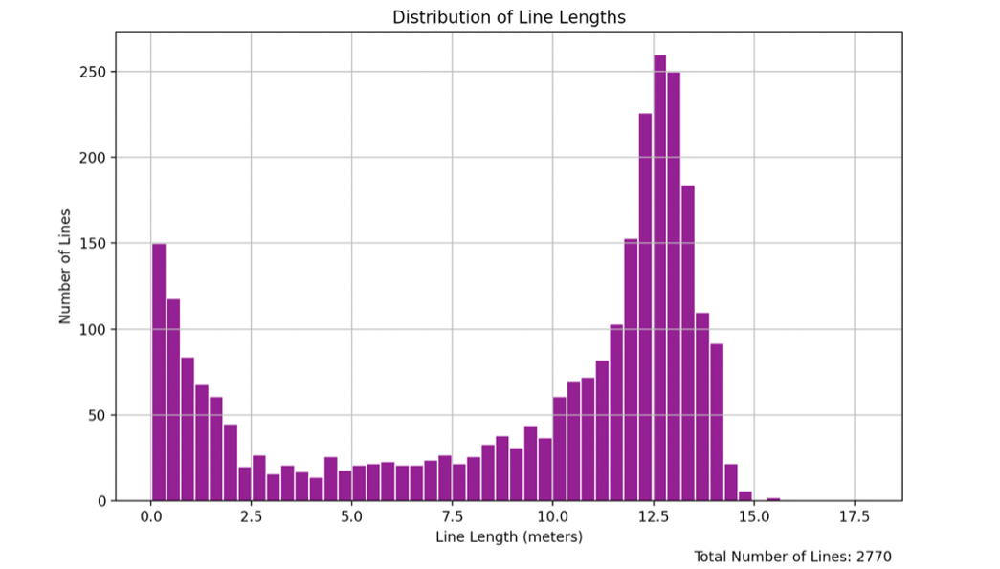 | 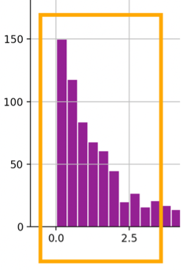 |

   ***

   |                               **Before Length Filter**                               |                              **After Length Filter**                               |
   | :----------------------------------------------------------------------------------: | :--------------------------------------------------------------------------------: |
   |  | 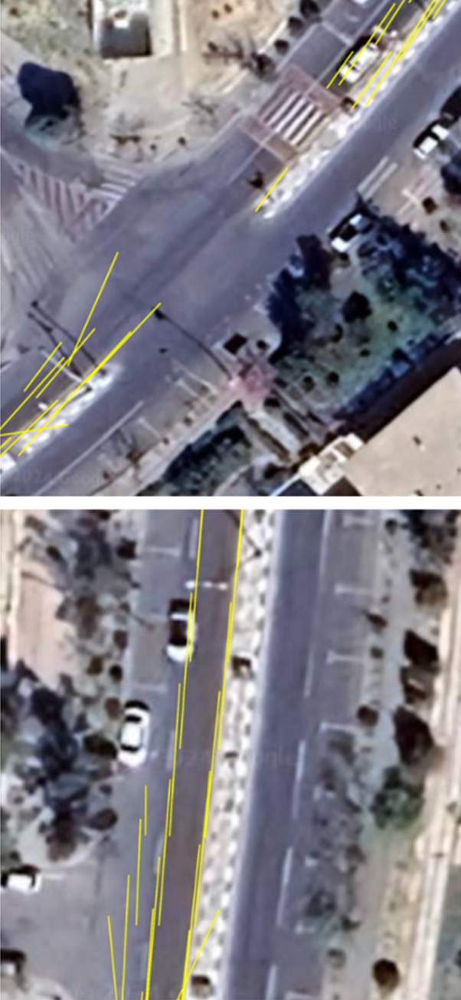 |

 

2. **Filtering Lines with Unusual Slopes**: In a straight and flat road, when viewed from above (bird's eye view), the slope of the road lines tends to infinity. Therefore, if a line has a slope close to zero, it's likely a noise and should be filtered out.

    

   |                             **Straight Road Lines from Bird's Eye View**                             |                                         **Line with Unusual Slope on Straight Road**                                         |
   | :--------------------------------------------------------------------------------------------------: | :--------------------------------------------------------------------------------------------------------------------------: |
   |  | 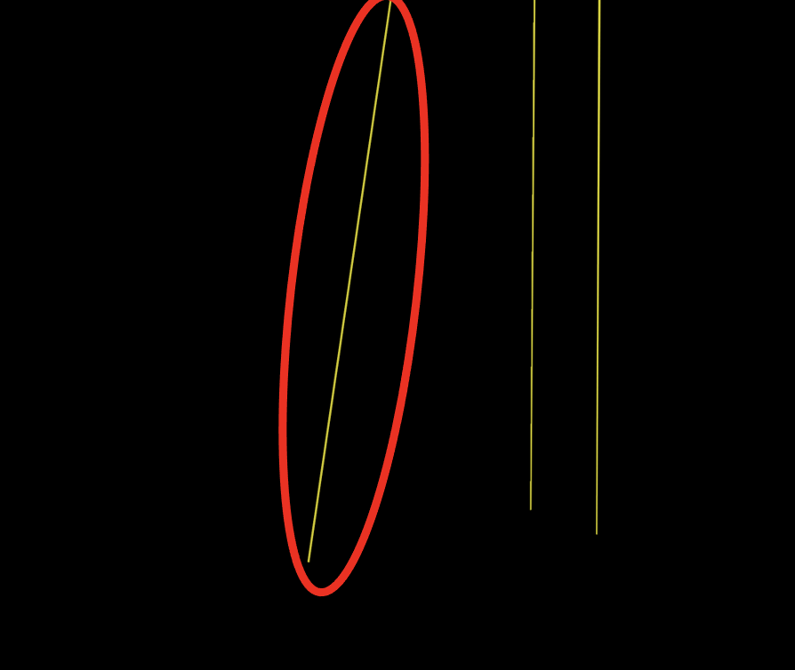 |

    
   &nbsp;&nbsp;&nbsp;&nbsp;To address this, we analyze the vehicle's movement by taking the derivative of the angular rotation data to calculate the angular velocity. The graph below shows the angular rotation and angular velocity over time. Using this angular velocity, we can identify road curves (by setting a threshold) and avoid filtering out the lines located on curves during the filtering process.

   

     
   

   

       Angular Rotation and Angular Velocity
   

   ***

    

   |                              **Before Slope Filter**                               |                              **After Slope Filter**                              |
   | :--------------------------------------------------------------------------------: | :------------------------------------------------------------------------------: |
   | 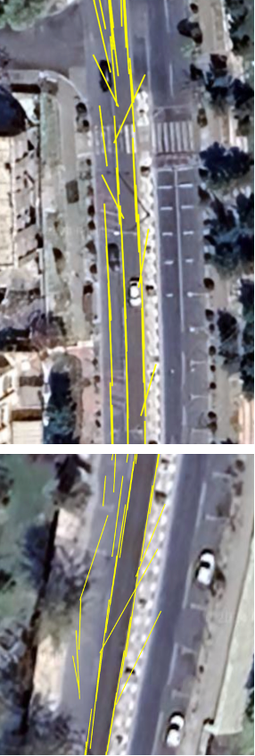 | 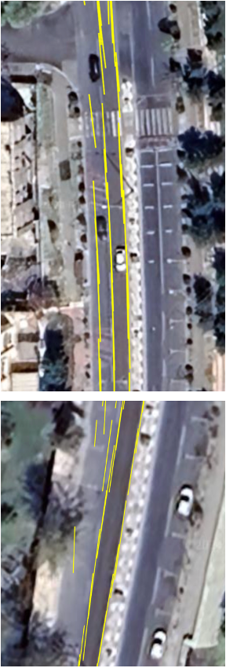 |

   ***

    

   

     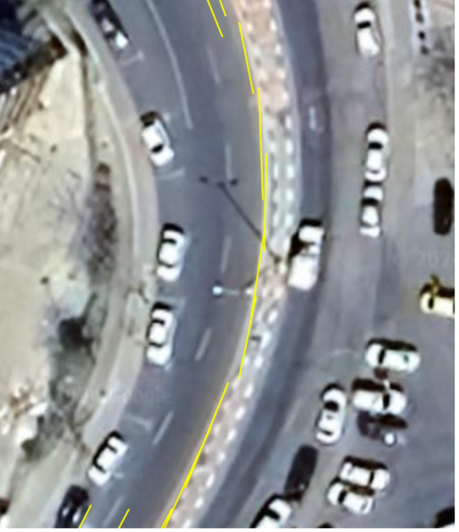
   

   

     Avoiding Removal of Lines in Road Curves Using Angular Velocity Analysis
   

   ***

    

3. **Filtering Out Lines That Are Too Close in a Single Frame:** This noise is primarily due to the presence of parking lines on the side of the road, which the model mistakenly identifies as drivable lane lines. To address this, we set a threshold for the distance between lines and eliminate the noisy lines that are too close to the actual lane lines.

   |                                     **Before Filtering Too Close Lines**                                     |                                    **After Filtering Too Close Lines**                                     |
   | :----------------------------------------------------------------------------------------------------------: | :--------------------------------------------------------------------------------------------------------: |
   | 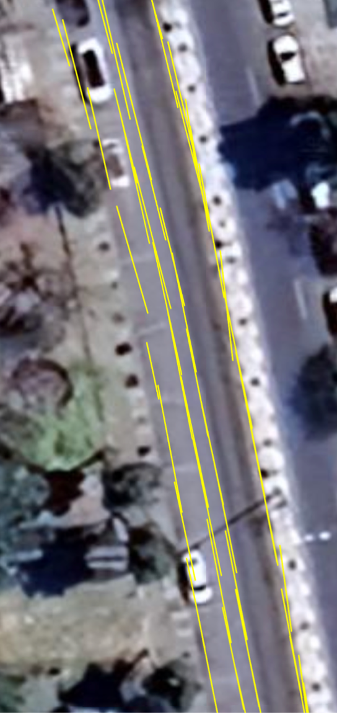 | 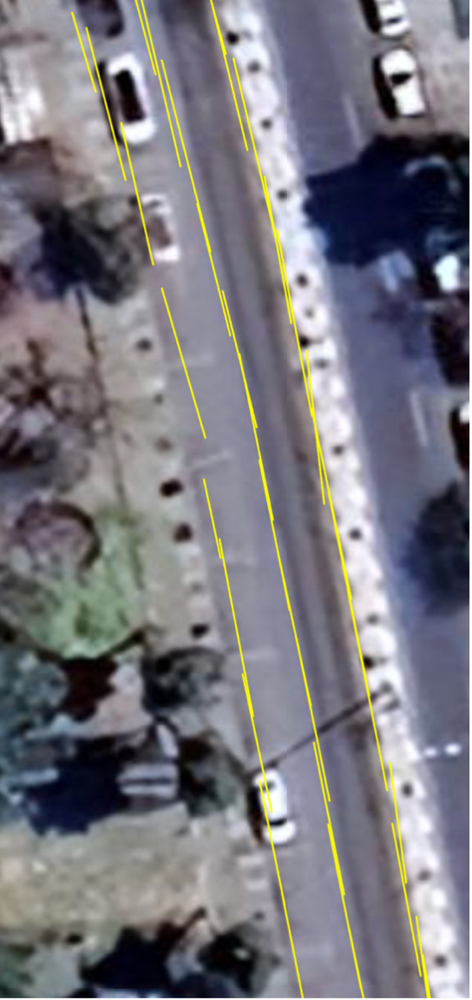 |

   ***

 

### $\color{gold}{4-}$ Finding the global position of the lines

&nbsp;&nbsp;&nbsp;&nbsp;This task is accomplished using the [`line_pixels_to_real_coordinates.py`](https://github.com/alirezaghafari/Smart-road-lines-detection_and_integration_with_GIS/blob/master/main%20codes/line_pixels_to_real_coordinates.py) file. In this file, the camera position is first identified within the image. Then, the position of each pixel is determined relative to the origin, which is the camera. Considering the image scale, which is 10 centimeters per pixel, the global position of the lines can be established.

Therefore, this file, with three inputs:

- [`locations_and_magneticHeadings.json`](https://github.com/alirezaghafari/Smart-road-lines-detection_and_integration_with_GIS/blob/master/locations_data/locations_and_magneticHeadings.json)
- [`timestamp_of_each_frame.json`](https://github.com/alirezaghafari/Smart-road-lines-detection_and_integration_with_GIS/blob/master/output_jsons/timestamp_of_each_frame.json)
- [`3_filtered_lines_by_length_and_slope_and_yaw_and_closeLines.json`](https://github.com/alirezaghafari/Smart-road-lines-detection_and_integration_with_GIS/blob/master/output_jsons/3_filtered_lines_by_length_and_slope_and_yaw_and_closeLines.json)

produces the output [`lines_coords.json`](https://github.com/alirezaghafari/Smart-road-lines-detection_and_integration_with_GIS/blob/master/output_jsons/lines_coords.json), which stores the global position data of all lines in each frame.

 

### $\color{gold}{5-}$ Smoothing the sequential lines

&nbsp;&nbsp;&nbsp;&nbsp;Due to minor computational errors in positioning, inaccuracies in the motion and location sensors of the mobile phone, and image distortion caused by the camera, consecutive lines along the same path are not perfectly aligned. These errors are inevitable. For a better understanding, please refer to the image below:

   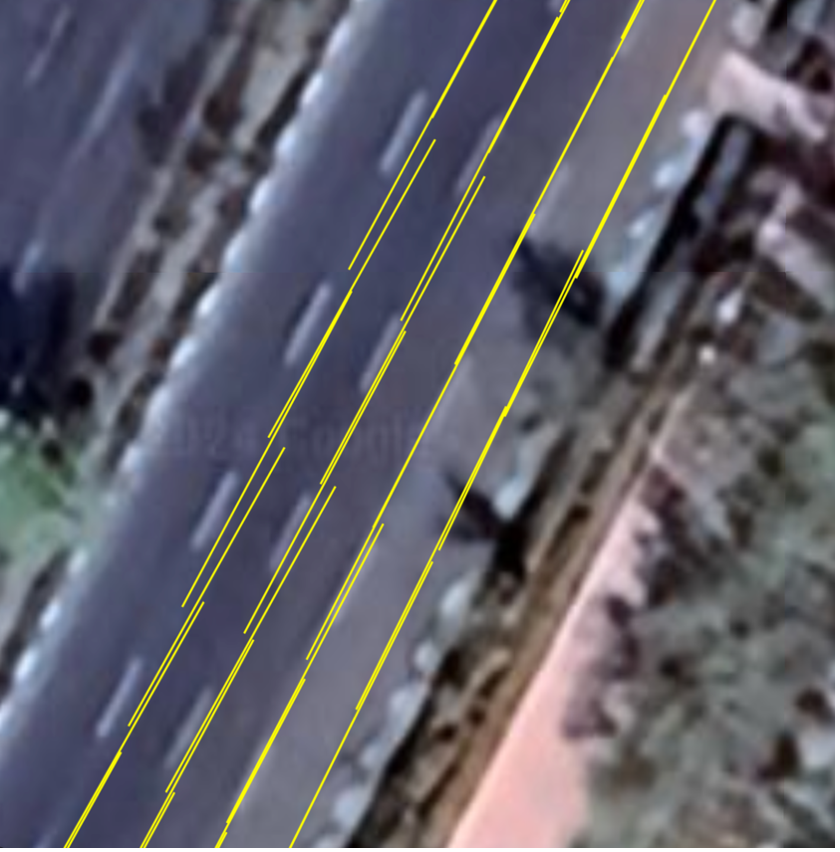

   Misalignment of Sequential Lines Due to Sensor and Positional Errors

 

&nbsp;&nbsp;&nbsp;&nbsp;To address this issue, we employed a probabilistic approach similar to the Kalman filter, but simplified for implementation. Each point on a line is assigned a probability distribution, and the distributions of points on consecutive lines are combined to produce a single smoothed line. The distributions for points at the start of a line have lower variance, while those at the end have higher variance. This is because the points at the beginning of each line are more significant, as they were closer to the camera when the image was captured and thus have a higher likelihood of being accurate.

&nbsp;&nbsp;&nbsp;&nbsp;This method ensures that the final smoothed line accurately represents the sequence of detected lines, minimizing the impact of small errors in positioning, sensor data, and image distortion.

  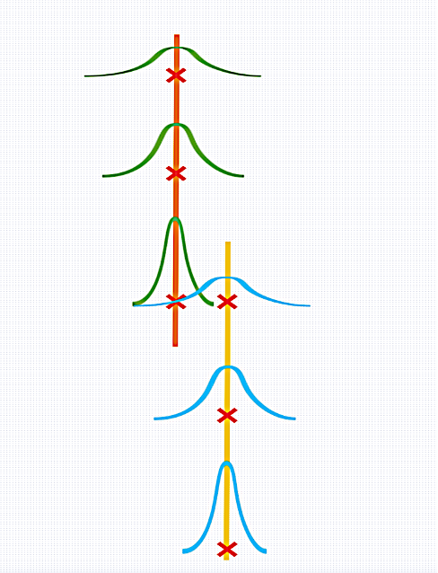

  Probability Distributions of Points on Consecutive Lines (We Want to Combine Them)

 

&nbsp;&nbsp;&nbsp;&nbsp;This is accomplished using the [`smooth_lines.py`](https://github.com/alirezaghafari/Smart-road-lines-detection_and_integration_with_GIS/blob/master/main%20codes/smooth_lines.py) file. This file takes [`lines_coords.json`](https://github.com/alirezaghafari/Smart-road-lines-detection_and_integration_with_GIS/blob/master/output_jsons/lines_coords.json) as input and produces [`final_smoothed_lines.kml`](<https://github.com/alirezaghafari/Smart-road-lines-detection_and_integration_with_GIS/blob/master/output_kmls/smoothed_lines(final_output)/final_smoothed_lines.kml>), which is the final output of this project.

 

# Results

&nbsp;&nbsp;&nbsp;&nbsp;You can view the output by drag and drop [`final_smoothed_lines.kml`](<https://github.com/alirezaghafari/Smart-road-lines-detection_and_integration_with_GIS/blob/master/output_kmls/smoothed_lines(final_output)/final_smoothed_lines.kml>) file into a GIS tool such as Google Earth. Below are some images showcasing the results:

  

  Visualized Smoothed Lines on Map (Final Result of My Project)

 

# Quick Summary of Execution Steps

**Execute these files in the following order:**

1. Run [`extract_timestamp_of_each_frame.py`](https://github.com/alirezaghafari/Smart-road-lines-detection_and_integration_with_GIS/blob/master/main%20codes/extract_timestamp_of_each_frame.py) to extract and save the timestamp of each frame from the video. You will need the timestamp of the first frame, which is stored by the timestamp camera.
2. Run [`vehicle_angular_velocity.py`](https://github.com/alirezaghafari/Smart-road-lines-detection_and_integration_with_GIS/blob/master/main%20codes/vehicle_angular_velocity.py) to calculate the angular velocity of the vehicle from mobile phone orientation and save the data for later use.
3. Run [`mask_of_all_frames.py`](https://github.com/alirezaghafari/Smart-road-lines-detection_and_integration_with_GIS/blob/master/laneaf_inference/mask_of_all_frames.py) to generate binary masks for video frames.
4. Run [`masks_to_line_equation.py`](https://github.com/alirezaghafari/Smart-road-lines-detection_and_integration_with_GIS/blob/master/main%20codes/masks_to_line_equation.py) to convert the masks to line equations and generate [`lines_data.json`](https://github.com/alirezaghafari/Smart-road-lines-detection_and_integration_with_GIS/blob/master/output_jsons/lines_data.json).
5. Run [`noise_filter.py`](https://github.com/alirezaghafari/Smart-road-lines-detection_and_integration_with_GIS/blob/master/main%20codes/noise_filter.py) to filter out noisy lines and generate [`3_filtered_lines_by_length_and_slope_and_yaw_and_closeLines.json`](https://github.com/alirezaghafari/Smart-road-lines-detection_and_integration_with_GIS/blob/master/output_jsons/3_filtered_lines_by_length_and_slope_and_yaw_and_closeLines.json).
6. Run [`line_pixels_to_real_coordinates.py`](https://github.com/alirezaghafari/Smart-road-lines-detection_and_integration_with_GIS/blob/master/main%20codes/line_pixels_to_real_coordinates.py) to calculate the global position of lines and generate [`lines_coords.json`](https://github.com/alirezaghafari/Smart-road-lines-detection_and_integration_with_GIS/blob/master/output_jsons/lines_coords.json).
7. Run [`smooth_lines.py`](https://github.com/alirezaghafari/Smart-road-lines-detection_and_integration_with_GIS/blob/master/main%20codes/smooth_lines.py) to smooth the lines and produce the final output [`final_smoothed_lines.kml`](<https://github.com/alirezaghafari/Smart-road-lines-detection_and_integration_with_GIS/blob/master/output_kmls/smoothed_lines(final_output)/final_smoothed_lines.kml>).

 

**Optional Files:**

- [`create_kml_of_captured_locations.py`](https://github.com/alirezaghafari/Smart-road-lines-detection_and_integration_with_GIS/blob/master/main%20codes/create_kml_of_captured_locations.py) writes the updated locations of the mobile phone to a KML file, ignoring duplicate locations and only considering new positions.
- [`correct_locations.py`](https://github.com/alirezaghafari/Smart-road-lines-detection_and_integration_with_GIS/blob/master/main%20codes/correct_locations.py) can be used to correct location errors across the street. It takes a KML of your driving path and shifts the recorded locations to the nearest point on that path. For example, if you were driving in the second lane, but the locations were recorded in the third lane (due to sensor errors), you can draw a path in the second lane and provide the KML file to this Python script to correct the erroneous locations.

 

## Contacts

If you have any questions or need further information, feel free to reach out:

- **Email:** [areza.ghafari01@gmail.com](mailto:areza.ghafari01@gmail.com)

For any issues or contributions related to this project, please open an issue or submit a pull request on the [GitHub repository](https://github.com/alirezaghafari/Smart-road-lines-detection_and_integration_with_GIS).
