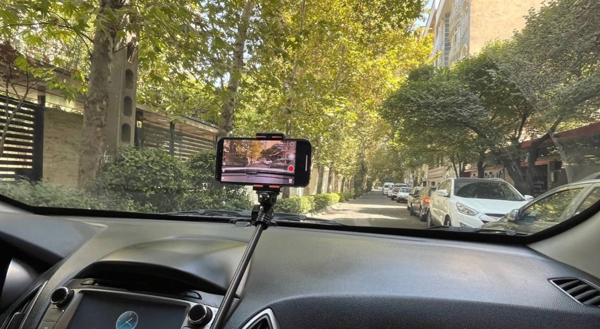
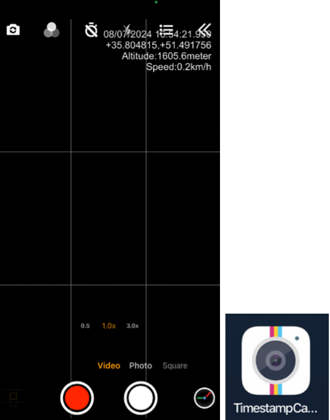

# Table of Contents

- [About](#about)
- [Demo](#demo)
- [Implementation](#Implementation)

# About

&nbsp;&nbsp;&nbsp;&nbsp;This repository contains the code and resources for my bachelor's thesis project at Amirkabir University of Tehran. The project focuses on the automated detection of road lines and integration into Geographic Information System (GIS) using smartphone-based camera and motion data. The approach leverages a deep learning model to detect road lines from videos, processes and filters the detected lines, and visualizes them on a map, providing an efficient and cost-effective solution for urban infrastructure monitoring.

This approach has two significant applications:

1. **Urban Infrastructure Monitoring**: The generated maps can assist municipalities in monitoring and improving road line markings.
2. **Autonomous Vehicles**: Accurate road line information provides crucial data for autonomous vehicle systems, helping them better identify paths and make decisions in situations where the distance is beyond the range of the vehicle's cameras and sensors.

**--> Line detection deep learning model:**  
&nbsp;&nbsp;&nbsp;&nbsp;For the road line detection, we utilized the [LaneAF](https://paperswithcode.com/paper/laneaf-robust-multi-lane-detection-with) model with DLA-34 backbone, which has been pre-trained on the CULane dataset. This model provides high accuracy in detecting lane markings under various conditions. The LaneAF model was developed by Hala Abualsaud and her collaborators. For more details on the LaneAF model and its implementation, please refer to the [LaneAF GitHub repository](https://github.com/sel118/LaneAF?tab=readme-ov-file).

# Demo

To better understand what has been accomplished in this project, here is a demonstration of the results.  
For testing the project, we selected two streets with a total length of 4 kilometers in Tehran city. [Tap to see on the map.](https://www.google.com/maps?q=35.756888,51.372461) 
To view the visualized lane lines of these two streets (final output of my project), simply drag and drop the [`final_smoothed_lines.kml`](<https://github.com/alirezaghafari/Smart-road-lines-detection_and_integration_with_GIS/tree/master/output_kmls/smoothed_lines(final_output)/>) file into a GIS tool such as Google Earth. Some of the images are shown below:

### Detected Road Lines Using LaneAF:

  

### Visualized Lines on Map (Final Result of My Project):

  

# Implementation

For visualizing road lines on the map, you only need:

1. **Video of the street with exact timestamps** for syncing frames with location and motion data. LaneAF will predict lines on these frames.
2. **Precise location and magnetic heading** of the phone, both with millisecond timestamps.
3. **IMU data** for phone rotation.
4. **Precise position of objects in a few pixels** relative to the camera (assuming the camera is at the origin). This is used for positioning all other pixels relative to the camera. So you need to record at least 4 pixels' coordinates (x, y) and the position of objects represented by these pixels relative to the camera.

 

### 1- Videos of The Streets

&nbsp;&nbsp;&nbsp;&nbsp;Initially, you need to collect videos of the streets to identify the road markings. The more similar the features of the images, such as zoom and camera angle, are to the CULane dataset, the better the results you will achieve with the LaneAF model. You can see an example of a suitable image in the [Demo](#demo) section. We fixed the camera using a mount on the vehicle's dashboard and set the camera zoom to 0.5x, which provided very good results. For this task, we used an iPhone camera and the third-party app TimestampCamera to precisely record the exact timestamp of each frame to the millisecond.

  <figure style="flex: 1; text-align: center; margin-right: 20px;">
    
  </figure>
  <figure style="flex: 1; text-align: center;">
    
  </figure>

 
 

### 2- Location and Magnetic Heading

&nbsp;&nbsp;&nbsp;&nbsp;For precise recording of latitude, longitude, and magnetic heading at any given moment, we developed a Swift application called [MyApp](<https://github.com/alirezaghafari/Smart-road-lines-detection_and_integration_with_GIS/tree/master/myapp%20(to_record_locations_and_magnetic_headings)>). This app captures these data at a frequency of 50 Hz. The geographic coordinates (latitude and longitude) recorded each second usually remain the same due to the mobile sensor limitations. However, the main purpose of our application is to determine the exact moment when new location data is updated. This ensures that we can select a frame from the video for visualizing road markings with confidence, knowing that we have the most current location data. As a result, the error from the phone’s low-frequency position measurements is reduced to just one-fiftieth of what it would be with once-per-second location updates.

  <figure style="flex: 1; margin-right: 20px; max-width: 100%; text-align: center;">
    
    <figcaption>Myapp Records Locations and Magnetic Heading</figcaption>
  </figure>

