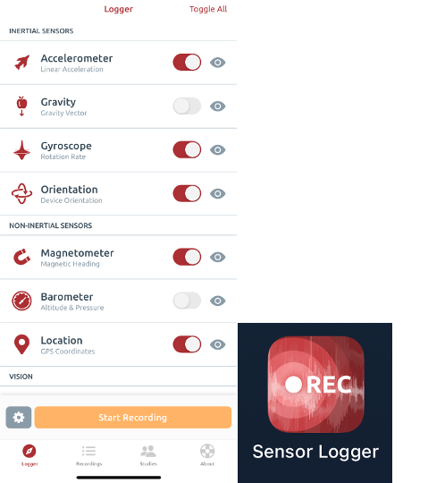

# Table of Contents

- [About](#about)
- [Demo](#demo)
- [Essential Data Collection](#essential-data-collection)
- [Implementation](#implementation)

 
 

# About

&nbsp;&nbsp;&nbsp;&nbsp;This repository contains the code and resources for my bachelor's thesis project at Amirkabir University of Tehran. The project focuses on the automated detection of road lines and integration into Geographic Information System (GIS) using smartphone-based camera and motion data. The approach leverages a deep learning model to detect road lines from videos, processes and filters the detected lines, and visualizes them on a map, providing an efficient and cost-effective solution for urban infrastructure monitoring.

This approach has two significant applications:

1. **Urban Infrastructure Monitoring**: The generated maps can assist municipalities in monitoring and improving road line markings.
2. **Autonomous Vehicles**: Accurate road line information provides crucial data for autonomous vehicle systems, helping them better identify paths and make decisions in situations where the distance is beyond the range of the vehicle's cameras and sensors.

**--> Line detection deep learning model:**  
&nbsp;&nbsp;&nbsp;&nbsp;For the road line detection, we utilized the [LaneAF](https://paperswithcode.com/paper/laneaf-robust-multi-lane-detection-with) model with DLA-34 backbone, which has been pre-trained on the CULane dataset. This model provides high accuracy in detecting lane markings under various conditions. The LaneAF model was developed by Hala Abualsaud and her collaborators. For more details on the LaneAF model and its implementation, please refer to the [LaneAF GitHub repository](https://github.com/sel118/LaneAF?tab=readme-ov-file).

 
 

# Demo

To better understand what has been accomplished in this project, here is a demonstration of the results.  
For testing the project, we selected two streets with a total length of 4 kilometers in Tehran city. [Tap to see on the map.](https://www.google.com/maps?q=35.756888,51.372461) 
To view the visualized lane lines of these two streets (final output of my project), simply drag and drop the [`final_smoothed_lines.kml`](<https://github.com/alirezaghafari/Smart-road-lines-detection_and_integration_with_GIS/tree/master/output_kmls/smoothed_lines(final_output)/>) file into a GIS tool such as Google Earth. Some of the images are shown below:

### Detected Road Lines Using LaneAF:

  

### Visualized Lines on Map (Final Result of My Project):

  

 
 

# Essential Data Collection

For visualizing road lines on the map, you only need:

1. **Video of the street with exact timestamps** for syncing frames with location and motion data. LaneAF will predict lines on these frames.
2. **Precise location and magnetic heading** of the phone, both with millisecond timestamps.
3. **IMU data** for mobile phone rotation.
4. **Precise position of objects within a few pixels relative to the camera** (assuming the camera is at the origin). This is used for positioning all other pixels relative to the camera. So you need to record at least 4 pixels' coordinates (x, y) and the position of objects represented by these pixels relative to the camera.

 

### $\color{gold}{1-}$ Videos of The Streets

&nbsp;&nbsp;&nbsp;&nbsp;Initially, you need to collect videos of the streets to identify the road markings. The more similar the features of the images, such as zoom and camera angle, are to the CULane dataset, the better the results you will achieve with the LaneAF model. You can see an example of a suitable image in the [Demo](#demo) section. We fixed the camera using a mount on the vehicle's dashboard and set the camera zoom to 0.5x, which provided very good results. For this task, we used an iPhone camera and the third-party app [TimestampCamera](http://www.timestampcamera.com/) to precisely record the exact timestamp of each frame to the millisecond.

<table style="width: 100%; table-layout: fixed;">
  <tr>
    <td style="vertical-align: bottom; text-align: center;">
      <figure style="margin: 0;">
        
        <figcaption style="margin-top: 10px;">Camera Fixed on the Vehicle's Dashboard</figcaption>
      </figure>
    </td>
    <td style="vertical-align: bottom; text-align: center;">
      <figure style="margin: 0;">
        
        <figcaption style="margin-top: 10px;">Timestamp Camera iOS App</figcaption>
      </figure>
    </td>
  </tr>
</table>

 
 

### $\color{gold}{2-}$ Location and Magnetic Heading

&nbsp;&nbsp;&nbsp;&nbsp;For precise recording of latitude, longitude, and magnetic heading at any given moment, we developed a Swift application called [MyApp](<https://github.com/alirezaghafari/Smart-road-lines-detection_and_integration_with_GIS/tree/master/myapp%20(to_record_locations_and_magnetic_headings)>). This app captures these data at a frequency of 50 Hz. The geographic coordinates (latitude and longitude) recorded each second usually remain the same due to the mobile sensor limitations. However, the main purpose of our application is to determine the exact moment when new location data is updated. This ensures that we can select a frame from the video for visualizing road markings with confidence, knowing that we have the most current location data. As a result, the error from the phone’s low-frequency position measurements is reduced to just one-fiftieth of what it would be with once-per-second location updates.

  

  Myapp Records Locations and Magnetic Heading

 

### $\color{gold}{3-}$ IMU Data for Mobile Phone Rotation

&nbsp;&nbsp;&nbsp;&nbsp;To analyze vehicle movement, it is important to collect motion data from the mobile phone. For this purpose, we used the [Sensor Logger](https://github.com/tszheichoi/awesome-sensor-logger) app, which can record motion data at a high frequency. We utilized the angular rotation data of the mobile phone in the process of filtering out noisy lines.

  

  Sensor Logger Records IMU Data

 

### $\color{gold}{4-}$ Precise Position of Objects within a Few Pixels Relative to the Camera

&nbsp;&nbsp;&nbsp;&nbsp;During image capture, it's necessary to record the precise position of several objects within the image along with the pixels representing them, relative to the camera's position, which is assumed to be at the origin. This data will be used to determine the position of all pixels in the image using a homography matrix. To ensure the accuracy of this information, it's crucial that the camera remains fixed on the vehicle's dashboard throughout the recording, without any movement. Therefore, it's important to use a stable phone mount.  
&nbsp;&nbsp;&nbsp;&nbsp;To form a homography matrix, at least 4 pixels with their positions relative to the camera are required. For testing this project, we recorded 11 such points. The image below shows the recorded positions. Please note that this data is only valid for our images. Therefore, you will need to record the positions again on the day of your image capture.

  

    Precise Position of Objects within a Few Pixels Relative to the Camera

 
 

# Implementation

The implementation consists of five main steps:

1. **Detecting road lines within images** using the deep learning model and saving the binary masks.
2. **Modeling the road lines** with a linear equation using linear regression, followed by calculating the homography matrix to **position the modeled lines relative to the camera**.
3. **Filtering out noisy lines** to ensure accuracy.
4. **Finding the global position of the modeled lines** using the camera's location data and the position of each line relative to the camera (creating a KML file).
5. **Smoothing the sequential lines** that are not perfectly aligned with each other.

 
 

### $\color{gold}{1-}$ Detecting Road Lines within Images

To detect road lines in video, follow these steps:

1. **Download the [LaneAF GitHub repository](https://github.com/sel118/LaneAF)** and copy the files from the [`laneaf_inference`](https://github.com/alirezaghafari/Smart-road-lines-detection_and_integration_with_GIS/tree/master/laneaf_inference) folder we've provided into the LaneAF directory.

   > The [`net_0033.pth`](https://github.com/alirezaghafari/Smart-road-lines-detection_and_integration_with_GIS/blob/master/laneaf_inference/net_0033.pth) file contains the pre-trained model weights, trained on the CULane dataset. The [`mask_of_all_frames.py`](https://github.com/alirezaghafari/Smart-road-lines-detection_and_integration_with_GIS/blob/master/laneaf_inference/mask_of_all_frames.py) script is used to save binary masks for all frames in a video. It reads a video and saves all the masks in a folder. The [`visualize_laneaf_on_one.py`](https://github.com/alirezaghafari/Smart-road-lines-detection_and_integration_with_GIS/blob/master/laneaf_inference/visualize_laneaf_on_one.py) script saves the model's colored prediction for a single image. In this project, you need to run the `mask_of_all_frames.py` script, but we have also included the `visualize_laneaf_on_one.py` script as an optional tool, so you can view the colored output if needed.

2. You can perform predictions in two ways (prediction with CPU is not recommended as processing each frame may take several minutes):

   1. **If you have an NVIDIA GPU**, you can directly run the `mask_of_all_frames.py` or `visualize_laneaf_on_one.py` scripts.
   2. **Alternatively, you can use a T4 GPU on [Google Colab](https://colab.research.google.com/)**. We've provided a Jupyter notebook [`perdictByLaneaf.ipynb`](https://github.com/alirezaghafari/Smart-road-lines-detection_and_integration_with_GIS/blob/master/perdictByLaneaf.ipynb) for this purpose. You need to upload the LaneAF folder (with the 3 inference files copied into it) to your Google Drive. Then, run the notebook in Google Colab. Make sure to change your runtime to T4 GPU first.

By following these steps, you can effectively generate binary masks for road lines within your video frames.

> **Important Note:** Before predicting on video frames, crop the video to an aspect ratio of 1664x576 or a multiple of it. Otherwise, your output image may appear stretched, and the model may not perform well. It is recommended to crop out non-essential parts, such as the sky, to optimize the input for better results.

 

### $\color{gold}{2-}$ Modeling the road lines and positioning the modeled lines relative to the camera

The direct visualization and positioning of the model's output masks can be problematic for two main reasons:

- **Cluttered and messy map:** The road line markings have a significant width, leading to an overcrowded and confusing map.
- **Inefficient positioning:** Due to the large number of pixels representing the road lines, positioning becomes highly inefficient.

To address these issues, each road line needs to be modeled as a single line equation. This can be achieved using linear regression. By doing so, each road line is represented by a line equation, meaning that only the start and end points of each line in each frame will represent that road line. This approach results in a much cleaner final map and significantly reduces the number of necessary computations (since only the start and end points need to be positioned and visualized).

To better understand, look at the image below. It shows the original model's mask and the lines fitted using linear regression. In the end, we only need to visualize start and end points representing each road line and connect those two points, which results in faster processing.

| **Original Mask** | **Fitted Lines using Linear Regression** |
|:-------------------------:|:-----------------------------------------:|
|  |  |
